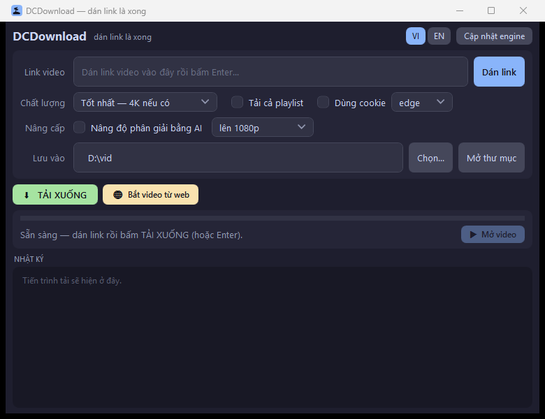
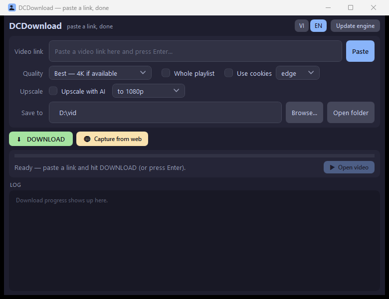
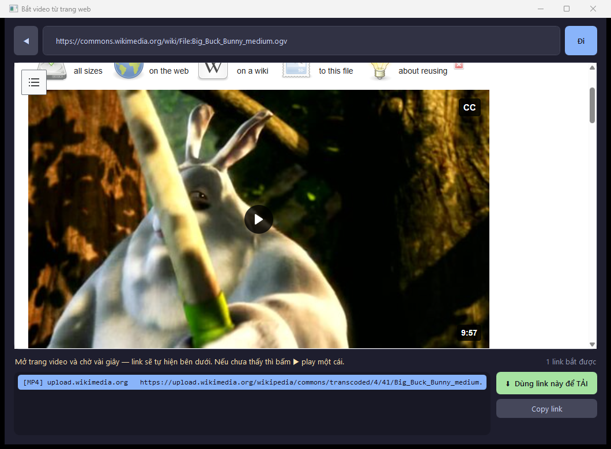

# DCDownload

*DragonCloud Download*

Paste a link, get the video. A small Windows app that works like the **Video DownloadHelper**
browser extension — including the part where it sniffs the video out of a page that hides it.

**[English](#english) · [Tiếng Việt](#tiếng-việt)**



---

## English

### What it is

A single-window Windows app (C# / WPF, ships as a native `.exe`): paste a URL, pick a quality, hit
download. No command line, no Python.

Under the hood it drives **yt-dlp** (open source, supports 1000+ sites: YouTube, Facebook, TikTok,
X/Twitter, Instagram, Twitch, Bilibili, SoundCloud, Vimeo, Dailymotion…) plus **ffmpeg** to merge
video and audio at full quality.

What it adds on top of plain yt-dlp is **Capture mode**: an embedded browser that watches network
traffic and grabs the stream URL out of pages yt-dlp doesn't know how to parse.

### Just want to use it? Run the installer

Grab **`DCDownload-Setup.exe`**, double-click, pick a folder, done. It puts the app in place, pulls
the engines down with a progress bar, and adds Start Menu and Desktop shortcuts. The app then shows
up in Windows' *Installed apps* list like any other program, so you can remove it from there.

The target machine needs **nothing** installed first — no .NET, no Python. The setup carries the
whole app (including the .NET runtime) inside it.

- Installer size: ~118 MB · downloads ~250 MB of engines during install · ~615 MB once installed
- Installs per-user into `%LOCALAPPDATA%\Programs\DCDownload`, so it never asks for admin rights
- The AI upscaling tool (+51 MB) is a checkbox — untick it if you do not want it

To build the installer yourself:

```powershell
powershell -ExecutionPolicy Bypass -File build-installer.ps1
```

It publishes the app self-contained, embeds it into the setup program, and writes
`dist\DCDownload-Setup.exe`.

### Build and install (once, after cloning)

```powershell
powershell -ExecutionPolicy Bypass -File setup.ps1
```

That one script does everything: downloads yt-dlp, ffmpeg + ffprobe and deno from their official
release pages into `bin\`, builds the app into `app\`, checks for the WebView2 Runtime, and puts a
**DCDownload** shortcut on your Desktop.

`bin\` is not committed because the engines total ~390 MB and ffmpeg alone exceeds GitHub's
100 MB per-file limit.

**Requirements:** Windows 10/11 and the [.NET SDK 10](https://dotnet.microsoft.com/download)
(`winget install Microsoft.DotNet.SDK.10`). WebView2 Runtime ships with Edge on Windows 11.

To rebuild after changing the code:

```powershell
dotnet publish src/SimpleVidDownload -c Release -o app
```

### Running it

Double-click the **DCDownload** shortcut, or `app\DCDownload.exe`. If your clipboard already holds a
URL, the app fills it in for you.

The whole interface speaks English too — hit **EN** in the header:



### Features

| Feature | Notes |
|---|---|
| Paste and download | **Dán link** button or Ctrl+V, then Enter |
| Quality picker | Best / 1080p / 720p / 480p / **audio-only MP3** |
| Playlists | Tick *Tải cả playlist* and paste a playlist URL |
| Login-gated videos | Tick *Dùng cookie* to reuse your browser session (private or age-restricted videos). Prefer `edge` or `firefox` — recent Chrome locks its cookie store |
| Live progress | Percentage, speed and full log inside the window |
| Cancel | The download button turns into a **cancel** button while running |
| Update engine | Refreshes yt-dlp — press this first when YouTube suddenly breaks |
| Language | **VI / EN** buttons in the header switch the whole interface; your choice is remembered |
| AI upscale | Optional, off by default — only offered when your GPU can actually run it |
| **Capture from a web page** | The Video DownloadHelper-style mode, described below |

### Capture mode — for pages yt-dlp reports as `Unsupported URL`

Use this for sites with no dedicated yt-dlp extractor, or that bury the video in an iframe.



1. Click **🌐 Bắt video từ trang web** to open the embedded browser (real Edge engine).
2. Navigate to the video page. Autoplay is enabled, so the stream usually starts on its own —
   often you never have to click **play** at all, which keeps you clear of ad overlays.
3. Captured links appear in the list below, tagged:
   - `[HLS]` — segmented stream (`.m3u8`), usually the best quality; merged into MP4 for you
   - `[MP4]` — a direct video file
   - `[NHUNG]` — an intermediate player page. Safe to pick: the app resolves it automatically
4. Select one, click **⬇ Dùng link này để TẢI**, then **TẢI XUỐNG** in the main window.

**Copy** grabs the raw URL if you want it elsewhere. Downloads are named after the page title,
since a raw stream URL carries no title of its own.

#### Automatic embed resolving

Plenty of sites route video through an intermediate player, most commonly `blogger.com/video.g`.
Hand that URL to yt-dlp and it fails with `Unable to extract JSON data`, because current Blogger
player pages no longer embed the video config that yt-dlp's extractor looks for.

The app works around it: when the link to download is an embed page, it opens that player in a
small background window, lets it start, captures the real `googlevideo` stream URL, and only then
hands it to yt-dlp. Takes about five seconds and closes itself. This also works if you paste a
`blogger.com/video.g` link directly into the address box.

If it hasn't succeeded after 30 seconds the window stays open with the player visible, so you can
click **play** yourself and it will pick the stream up immediately.

#### Why this works when pasting the link doesn't

- **Pasting a link:** yt-dlp fetches the raw HTML and parses it using one of ~1,800 site-specific
  extractors. If a site has no extractor and hides its video behind JavaScript or a cross-origin
  iframe, there is nothing to find — hence `Unsupported URL`.
- **Capture mode:** a real browser runs all of that JavaScript, because the page *has* to hand the
  video to its own player in order to play it. The app just listens on the network layer, takes the
  stream URL along with the **cookies, referer and user-agent** of that very session, and passes
  them to yt-dlp. To the server it looks exactly like a browser playing the video.

Two things it does that a plain sniffer misses: it captures requests made inside **cross-origin
iframes** (many video sites embed a player from another domain), and it recognises streams by
**Content-Type**, so URLs with no `.mp4` or `.m3u8` extension still get caught. Ad hosts and
individual stream segments are filtered out of the list.

### AI upscaling — and when it is actually worth it

First, the distinction that matters: if a site already offers 1080p and you ended up with 360p, you
do not need upscaling — just download the better version, which the quality picker already does.

Upscaling is for the other case: the source genuinely has nothing sharper. Plain `ffmpeg` scaling
adds **no** detail there — it only makes the file nine times bigger and blurrier, and your player
already scales to fullscreen anyway. So this app uses **Real-ESRGAN**, which reconstructs plausible
detail rather than merely stretching pixels.

The cost is time. Measured on an RTX 4060 Ti at 360p → 1080p: **about 11 frames per second**, i.e.
roughly two minutes of work per minute of video. A 10-minute clip takes around 23 minutes.

Because of that, the option is **off by default** and never runs on its own. Tick *Upscale with AI*,
pick a target, and it runs after the download finishes — with a percentage, a live time estimate,
and a cancel button. Your original file is always kept; the result is saved alongside it as
`name_1080p.mp4`.

The checkbox is only enabled if your machine can really do it. On startup the app upscales a tiny
64×64 test image: having Vulkan installed is not proof that it will work, so it checks for real.
When it cannot, the control stays disabled and says why on hover.

Internally the video is processed in ~10-second segments, and each segment's frames are deleted once
it is encoded. Extracting a whole 30-minute video to PNG frames first would need over 100 GB;
chunking keeps it near 1 GB no matter how long the video is.

### A note on non-ASCII filenames

Files land on disk with their accents intact. If the in-app log looks like it lost them, that is
only the log rendering — the `✅ Xong! Đã lưu: <filename>` line in the status bar shows the real
name.

(For the curious: yt-dlp writes its log in the Windows ANSI codepage by default, which mangles
non-Latin text, so the app passes `--encoding utf-8`. The usual suspects — `PYTHONUTF8=1`,
`PYTHONIOENCODING=utf-8`, `chcp 65001` — have no effect on the frozen `yt-dlp.exe`.)

### Troubleshooting

1. **YouTube breaks out of nowhere** → press **Cập nhật engine** and retry. YouTube changes its
   internals often; yt-dlp ships fixes every few days.
2. **"Sign in to confirm you're not a bot", or a private video** → tick *Dùng cookie* and choose
   the browser you are logged into.
3. **Site not supported** → try Capture mode. Full extractor list:
   <https://github.com/yt-dlp/yt-dlp/blob/master/supportedsites.md>
4. **DRM-protected services** (Netflix, Disney+…) cannot be downloaded. That is a hard limit, and
   Video DownloadHelper cannot do it either.

### Layout

```
Simple_Vid_Download\
├─ src\SimpleVidDownload\        ← the source (C# / WPF)
│  ├─ MainWindow.xaml(.cs)       ← main window
│  ├─ CaptureWindow.xaml(.cs)    ← embedded browser that sniffs links
│  ├─ ResolveWindow.xaml(.cs)    ← resolves embed pages into real streams
│  ├─ Theme.xaml                 ← one style sheet shared by all three windows
│  └─ Services\
│     ├─ MediaSniffer.cs         ← what counts as a video link
│     ├─ YtDlpRunner.cs          ← runs yt-dlp, parses progress
│     ├─ WebViewHeaders.cs       ← reads Referer / Cookie / User-Agent
│     ├─ AppPaths.cs             ← locates bin\ and the working folders
│     └─ Settings.cs             ← remembers folder + quality
├─ setup.ps1                     ← downloads engines, builds, makes the shortcut
├─ app\                          ← build output, DCDownload.exe (not in git)
├─ bin\                          ← yt-dlp, ffmpeg, ffprobe, deno (not in git)
├─ logs\                         ← one log per download (not in git)
├─ wvdata\                       ← embedded browser profile, holds cookies (not in git)
└─ settings.json                 ← your folder and quality (not in git)
```

### About the icon

The **DragonCloud** mark is hand-drawn by [@namthse01](https://github.com/namthse01)
([original sketch](docs/icon-source-drawing.png)). For the app icon the outline was filled into a
single solid silhouette and the cloud redrawn as clean overlapping circles, so it still reads at
16×16 on a taskbar.

### Please use it responsibly

Download things you have the right to download — your own uploads, content you are licensed to
keep, or material whose licence permits it. Respect each site's terms and your local copyright law.

---

## Tiếng Việt

### Đây là gì

Phần mềm tải video cho Windows (C# / WPF, chạy dưới dạng `.exe` gốc), tương đương extension
**Video DownloadHelper** nhưng mạnh hơn: dán link → chọn chất lượng → bấm **TẢI XUỐNG**.
Không cần dòng lệnh, không cần Python.

Engine bên dưới là **yt-dlp** (mã nguồn mở, hỗ trợ **hơn 1000 trang web**: YouTube, Facebook,
TikTok, X/Twitter, Instagram, Twitch, Bilibili, SoundCloud, Vimeo, Dailymotion...) và **ffmpeg**
để ghép video + âm thanh chất lượng cao.

Điểm hơn yt-dlp thuần là chế độ **Bắt video từ trang web**: một trình duyệt nhúng nghe tầng mạng
và chộp link stream ngay cả với những trang yt-dlp không đọc được.

### Chỉ muốn dùng thôi? Chạy file cài đặt

Lấy file **`DCDownload-Setup.exe`**, nháy đúp, chọn thư mục, xong. Nó tự đặt app vào chỗ, tải engine
kèm thanh tiến độ, tạo shortcut ở Start Menu và Desktop. Sau đó app hiện trong danh sách *Ứng dụng đã
cài* của Windows như mọi phần mềm khác, muốn gỡ thì gỡ ngay ở đó.

Máy nhận **không cần cài gì trước** — không .NET, không Python. File cài mang sẵn cả app lẫn .NET
runtime bên trong.

- File cài ~118 MB · lúc cài tải thêm ~250 MB engine · cài xong chiếm ~615 MB
- Cài theo người dùng vào `%LOCALAPPDATA%\Programs\DCDownload` nên **không cần quyền admin**
- Công cụ nâng cấp AI (+51 MB) là một ô tick — không cần thì bỏ tick

Muốn tự đóng gói file cài:

```powershell
powershell -ExecutionPolicy Bypass -File build-installer.ps1
```

Script build app kèm sẵn runtime, nhúng vào trình cài, rồi xuất ra `dist\DCDownload-Setup.exe`.

### Cài đặt cho người sửa code (sau khi clone)

```powershell
powershell -ExecutionPolicy Bypass -File setup.ps1
```

Một script lo hết: tải yt-dlp, ffmpeg + ffprobe, deno từ trang phát hành chính thức về `bin\`,
build app ra `app\`, kiểm tra WebView2 Runtime, rồi tạo shortcut **DCDownload** ngoài Desktop.

`bin\` không đưa lên git vì engine nặng tổng cộng ~390 MB, riêng ffmpeg đã vượt giới hạn 100 MB
mỗi file của GitHub.

**Yêu cầu:** Windows 10/11 và [.NET SDK 10](https://dotnet.microsoft.com/download)
(`winget install Microsoft.DotNet.SDK.10`). WebView2 Runtime có sẵn theo Edge trên Windows 11.

Sửa code xong thì build lại bằng:

```powershell
dotnet publish src/SimpleVidDownload -c Release -o app
```

### Cách chạy

Nháy đúp shortcut **DCDownload**, hoặc `app\DCDownload.exe`. Nếu clipboard đang có sẵn link thì app
tự điền luôn vào ô.

### Các tính năng

| Tính năng | Ghi chú |
|---|---|
| Dán link → tải | Nút **Dán link** hoặc Ctrl+V vào ô, bấm Enter là tải luôn |
| Chọn chất lượng | Tốt nhất / 1080p / 720p / 480p / **chỉ lấy MP3** |
| Tải cả playlist | Tick **Tải cả playlist** rồi dán link playlist |
| Video cần đăng nhập | Tick **Dùng cookie** (video riêng tư, giới hạn tuổi...) — nên chọn `edge` hoặc `firefox`, Chrome bản mới hay khóa cookie |
| Thanh tiến độ + log | Xem % tải, tốc độ, lỗi ngay trong app |
| Hủy giữa chừng | Nút TẢI XUỐNG biến thành nút **HỦY** khi đang tải |
| Cập nhật engine | Cập nhật yt-dlp — bấm cái này đầu tiên khi YouTube đột nhiên tải lỗi |
| Đổi ngôn ngữ | Nút **VI / EN** ở góc trên đổi toàn bộ giao diện; app nhớ lựa chọn của bạn |
| Nâng cấp AI | Tùy chọn, mặc định tắt — chỉ hiện dùng được khi GPU máy bạn chạy nổi |
| **Bắt video từ trang web** | Chế độ "y như Video DownloadHelper", xem mục dưới |

### Bắt video từ trang web — khi dán link báo `Unsupported URL`

Dùng khi trang không nằm trong danh sách yt-dlp hỗ trợ, hoặc giấu video trong iframe.


1. Bấm **🌐 Bắt video từ trang web** → mở trình duyệt nhúng (engine Edge thật).
2. Vào trang video. App đã bật tự động phát nên video thường tự chạy — **nhiều khi không cần bấm
   play**, đỡ bấm nhầm quảng cáo.
3. Link bắt được hiện dần ở danh sách dưới, có nhãn:
   - `[HLS]` — stream cắt nhỏ (`.m3u8`), chất lượng tốt nhất, app tự ghép thành MP4
   - `[MP4]` — file video trực tiếp
   - `[NHUNG]` — trang player trung gian. Cứ chọn bình thường, app tự giải mã
4. Chọn 1 link → **⬇ Dùng link này để TẢI** → về cửa sổ chính → **TẢI XUỐNG**.

Nút **Copy** để lấy link thô dùng chỗ khác. Tên file lấy theo tiêu đề trang, vì link stream trực
tiếp không mang tên video.

#### Tự giải mã link nhúng

Nhiều trang phim nhét video qua một player trung gian, hay gặp nhất là `blogger.com/video.g`. Đưa
thẳng link đó cho yt-dlp sẽ báo lỗi `Unable to extract JSON data`, vì trang Blogger đời mới không
còn nhúng sẵn thông tin video mà extractor của yt-dlp cần tìm.

App xử lý tự động: hễ link cần tải là link nhúng, app mở player đó trong một cửa sổ nhỏ, để nó
chạy, chộp lấy link `googlevideo` thật rồi mới giao cho yt-dlp. Mất khoảng 5 giây, cửa sổ tự đóng.
Dán thẳng link `blogger.com/video.g` vào ô địa chỉ cũng được xử lý y hệt.

Nếu quá 30 giây chưa được, cửa sổ vẫn hiện player để **bạn tự bấm ▶ một cái** rồi nó nhận ngay.

#### Vì sao cách này tải được còn dán link thường thì không?

- **Dán link thường:** yt-dlp tải HTML thô rồi tự mổ xẻ bằng một trong khoảng 1.800 bộ giải mã viết
  riêng cho từng trang. Trang nào không có bộ giải mã, mà video lại giấu sau JavaScript hoặc iframe
  khác domain, thì chịu → báo `Unsupported URL`.
- **Bắt video từ trang web:** trình duyệt thật chạy hết JavaScript, vì trang *phải* đưa video ra
  cho player thì mới phát được. App chỉ ngồi nghe tầng mạng, thấy video chạy qua là chộp link, kèm
  luôn **cookie + referer + user-agent** của chính phiên duyệt đó rồi giao cho yt-dlp. Máy chủ thấy
  y hệt một trình duyệt đang xem phim nên không chặn.

Hai điểm mà bộ bắt link thường bỏ sót nhưng app làm được: bắt cả request bên trong **iframe khác
domain** (rất nhiều trang phim nhúng player từ domain khác), và nhận diện stream qua
**Content-Type** nên link không có đuôi `.mp4`/`.m3u8` vẫn tóm được. Host quảng cáo và các mảnh
stream lẻ bị lọc khỏi danh sách.

### Nâng cấp bằng AI — và khi nào thật sự đáng dùng

Trước hết phải phân biệt: nếu trang web vốn có sẵn 1080p mà bạn lỡ tải 360p thì **không cần nâng cấp
gì cả** — chỉ cần tải lại bản 1080p, phần chọn chất lượng đã lo việc đó.

Nâng cấp chỉ dành cho trường hợp còn lại: nguồn thật sự không có bản nào nét hơn. Lúc đó phóng to
bằng `ffmpeg` thường **không thêm được chi tiết nào**, chỉ làm file nặng gấp chín lần và mờ hơn, mà
trình phát vốn đã tự phóng to khi xem toàn màn hình. Nên app dùng **Real-ESRGAN** — AI dựng lại chi
tiết chứ không phải kéo giãn pixel.

Cái giá là thời gian. Đo trên RTX 4060 Ti khi nâng 360p → 1080p: **khoảng 11 khung/giây**, tức mỗi
phút video mất chừng hai phút xử lý. Clip 10 phút mất khoảng 23 phút.

Vì vậy tùy chọn này **mặc định tắt** và không bao giờ tự chạy. Tick *Nâng độ phân giải bằng AI*, chọn
đích, nó sẽ chạy sau khi tải xong — có hiện phần trăm, ước lượng thời gian còn lại, và hủy được giữa
chừng. File gốc luôn được giữ nguyên; bản nâng cấp lưu cạnh đó với tên `tên_1080p.mp4`.

Ô tick chỉ bật khi máy bạn thật sự chạy được. Lúc khởi động app sẽ thử nâng một ảnh 64×64: có cài
Vulkan chưa chắc đã chạy nổi, nên phải thử thật. Máy nào không kham được thì ô đó để mờ và rê chuột
vào sẽ thấy lý do.

Bên trong, video được xử lý theo từng đoạn ~10 giây, xong đoạn nào xoá ảnh đoạn đó. Nếu rã cả video
30 phút ra ảnh PNG thì cần hơn 100 GB đĩa; cắt đoạn thì chỉ quanh 1 GB dù video dài bao nhiêu.

### Về tên file tiếng Việt

Tên file lưu trên đĩa **luôn đủ dấu**. Nếu khung log trong app hiện chữ mất dấu thì đó chỉ là hiển
thị — dòng `✅ Xong! Đã lưu: <tên file>` ở thanh trạng thái mới là tên thật.

(Kỹ thuật: yt-dlp mặc định ghi log theo bảng mã ANSI của Windows nên rụng dấu; app truyền thêm cờ
`--encoding utf-8`. Các cách quen thuộc như `PYTHONUTF8=1`, `PYTHONIOENCODING=utf-8` hay
`chcp 65001` đều **không** có tác dụng với bản `yt-dlp.exe` đóng gói.)

### Khi gặp lỗi

1. **Tải YouTube lỗi đột ngột** → bấm **Cập nhật engine** rồi thử lại. YouTube đổi API liên tục,
   yt-dlp cập nhật vài ngày một lần.
2. **"Sign in to confirm you're not a bot" / video riêng tư** → tick **Dùng cookie**, chọn trình
   duyệt bạn đang đăng nhập.
3. **Trang không hỗ trợ** → thử chế độ bắt video. Danh sách trang hỗ trợ:
   <https://github.com/yt-dlp/yt-dlp/blob/master/supportedsites.md>
4. **Video DRM** (Netflix, Disney+...) thì **không tải được** — đây là giới hạn chung, Video
   DownloadHelper cũng vậy.

### Cấu trúc thư mục

```
Simple_Vid_Download\
├─ src\SimpleVidDownload\        ← mã nguồn (C# / WPF)
│  ├─ MainWindow.xaml(.cs)       ← cửa sổ chính
│  ├─ CaptureWindow.xaml(.cs)    ← trình duyệt nhúng để bắt link
│  ├─ ResolveWindow.xaml(.cs)    ← giải mã link nhúng ra stream thật
│  ├─ Theme.xaml                 ← một bộ style dùng chung cho cả ba cửa sổ
│  └─ Services\
│     ├─ MediaSniffer.cs         ← quyết định link nào là video
│     ├─ YtDlpRunner.cs          ← chạy yt-dlp, đọc tiến trình
│     ├─ WebViewHeaders.cs       ← đọc Referer / Cookie / User-Agent
│     ├─ AppPaths.cs             ← tìm bin\ và các thư mục làm việc
│     └─ Settings.cs             ← nhớ thư mục lưu + chất lượng
├─ setup.ps1                     ← tải engine, build, tạo shortcut
├─ app\                          ← bản build, DCDownload.exe (không đưa lên git)
├─ bin\                          ← yt-dlp, ffmpeg, ffprobe, deno (không đưa lên git)
├─ logs\                         ← log mỗi lần tải (không đưa lên git)
├─ wvdata\                       ← hồ sơ trình duyệt nhúng, chứa cookie (không đưa lên git)
└─ settings.json                 ← thư mục lưu + chất lượng đã chọn (không đưa lên git)
```

### Về cái icon

Hình **DragonCloud** do [@namthse01](https://github.com/namthse01) tự vẽ tay
([bản gốc](docs/icon-source-drawing.png)). Khi làm icon, phần trong đường viền được tô đặc thành một
khối duy nhất và đám mây vẽ lại bằng mấy vòng tròn chồng nhau cho sạch — để thu về 16×16 trên thanh
tác vụ vẫn nhìn ra hình.

### Dùng cho tử tế nhé

Chỉ tải những thứ bạn có quyền tải: video của chính bạn, nội dung bạn được cấp phép, hoặc thứ có
giấy phép cho phép. Tôn trọng điều khoản của từng trang và luật bản quyền nơi bạn ở.
